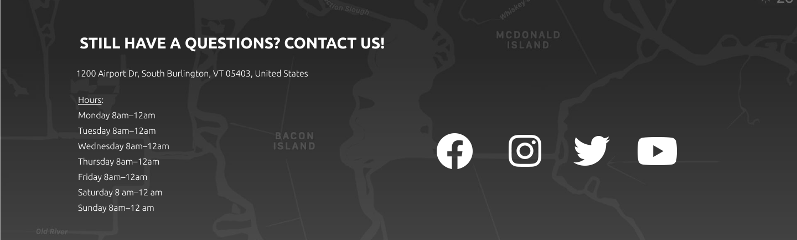
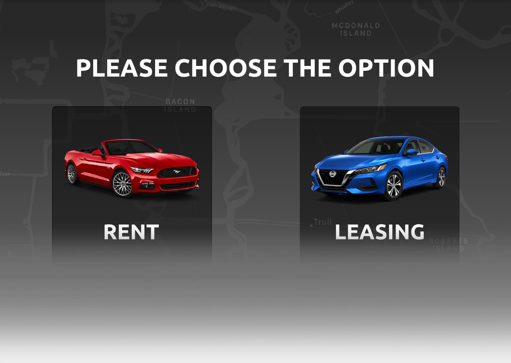
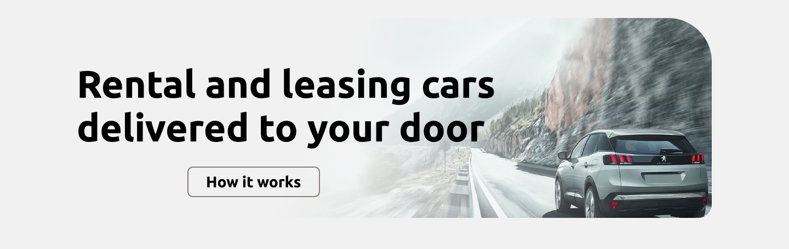
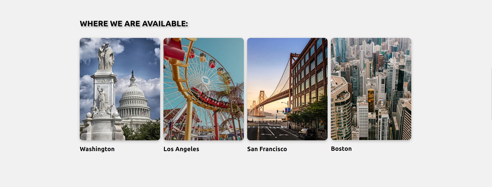
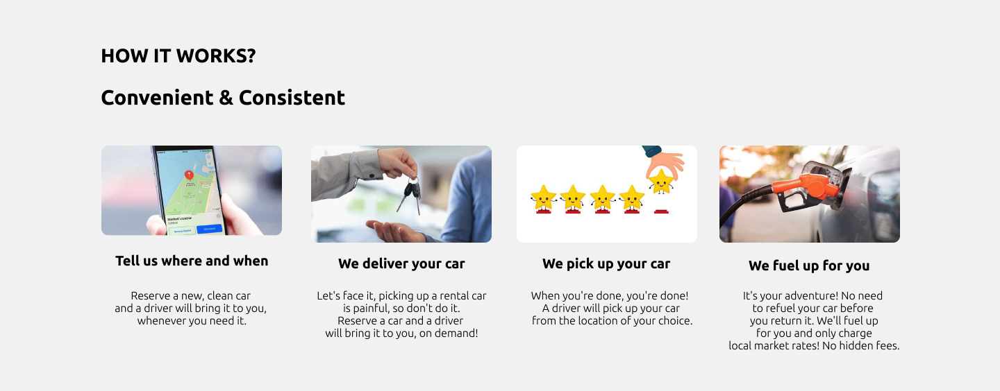
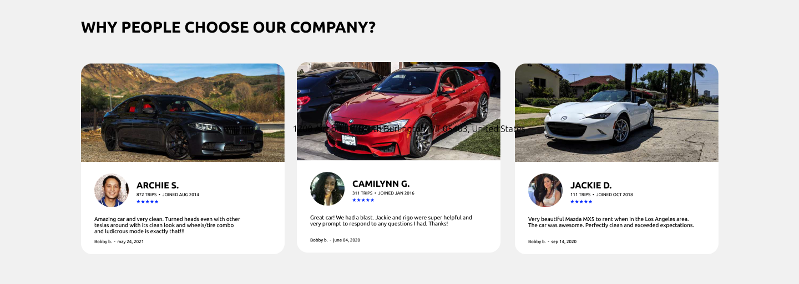
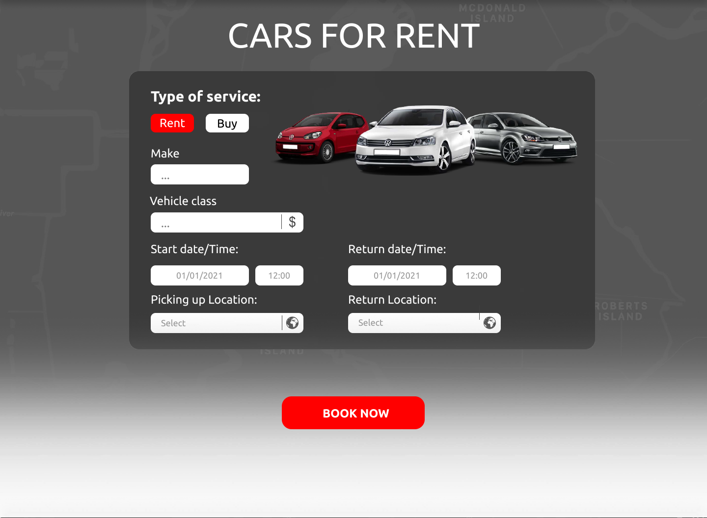
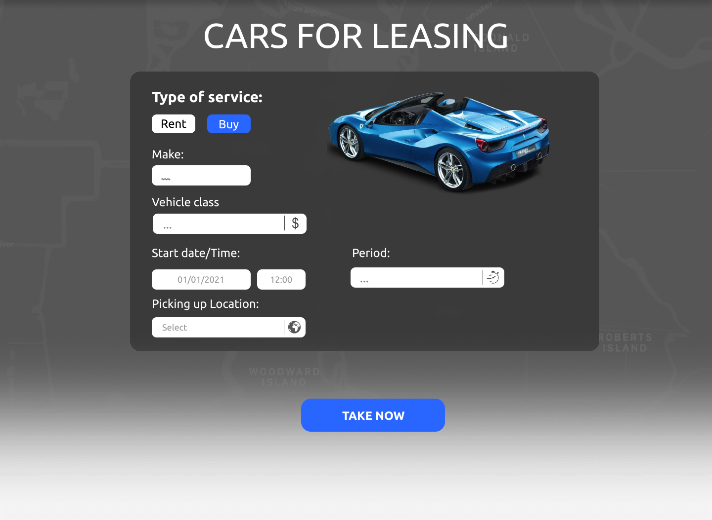
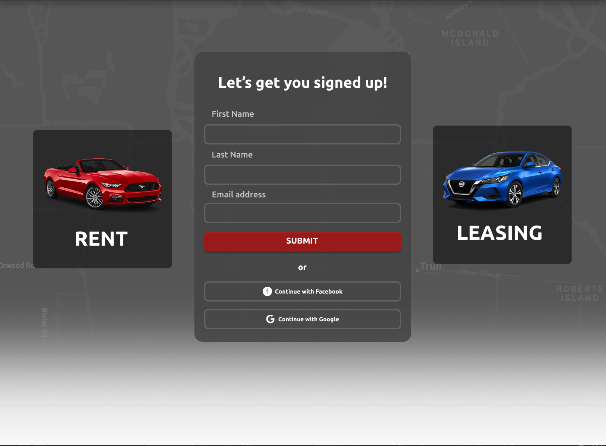

# CARRENT Car Rental and Leasing

CARRENT Car Rental and Leasing site is for those individuals and companies who need additional useful services while renting or leasig the car in a number of cities (Los Angeles, San Fransisco, Washington and Boston) in the US.

The site will be targeted to those who want to eliminate time-consuming process of renting or leasing a car, i. e. picking up a car, returning it to the desired location or filling up the tank before returning the car.

## Features

- __Navigation Bar__

    -  Featured on all four pages, the full responsive navigation bar includes links to the Logo, Rent and Leasing pages, Why CARRENT? section of the Home Page and Sign Up page and is identical in each page.
    - This section will allow the user to easily navigate from page to page across all devices without having to revert back to the previous page via the ‘back’ button.

    

- __The Footer__ 

    - The footer section includes links to the relevant social media sites for CARRENT. The links will open to a new tab to allow easy navigation for the user. It encourages them to keep connected via social media.
    - The footer also contains information about CARRENT address and openning hours.
    
    

- __Home Page__ 

    - the Main Image section
        - Contains Call to Action Section. 
        - Consists of two car images that are links to "Rent a Car" and "Lease a Car" site pages. These allows the user to choose between two optins, whether to rent or lease the car.

    

    - The firm ethos section
        - Contains the CARRENT hero image and slogan, which describes shortly the main goal of the firm.
        - Allows the user to see all the benefits of CARRENT service by clicking on "How it works button" which refers to appropriate section of the HOME PAGE.

    

    - Location section
        - Contains gallery of cities' images wehre CARRENT officies are presented.
        - This section is valuable to the users as they will be able to easily identify where they can use CARRENT service.

    

    - How it works section
        - Allows the user to see the benefits of using CARRENT services as compared to other competitors. 
        - The user will see the value of signing up to CARRENT site.

    

    - Why CARRENT? section
        - Shows clearly why people choose CARRENT Car Rental and Leasing company.
        - Contains a number of customers reviews where the describe their experience whit CARRENT

    

- __Cars For Rent Page__

    - Comprise a form for customers which intend to rent a car.
    - There are several mandatory and intuitively obvious fields that user have to fill in to book a car.

- __Cars For Lease Page__

    - Comprise a form for customers which intend to lease a car.
    - There are several mandatory and intuitively obvious fields that user have to fill in to get lease proposal.

- __The Sign Up Page__
    - This page will allow the user to get signed up to CARRENT to become a customer. 
    - The user will be asked to submit their full name and email address.
    - Also there is a possibility to quick register via visitor Facebook or Google account.

    
     

