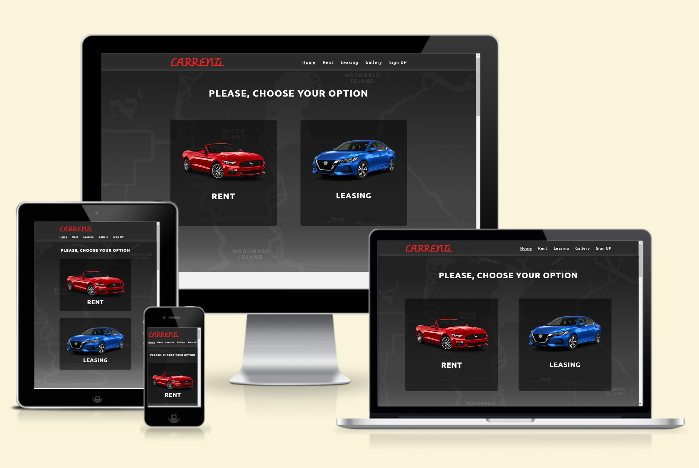
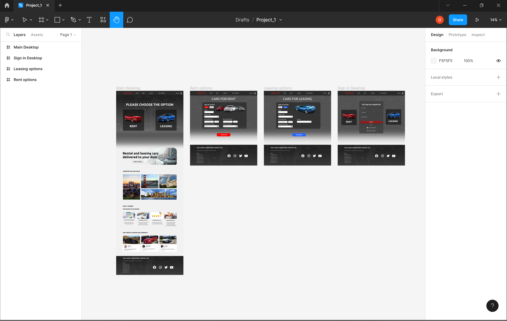
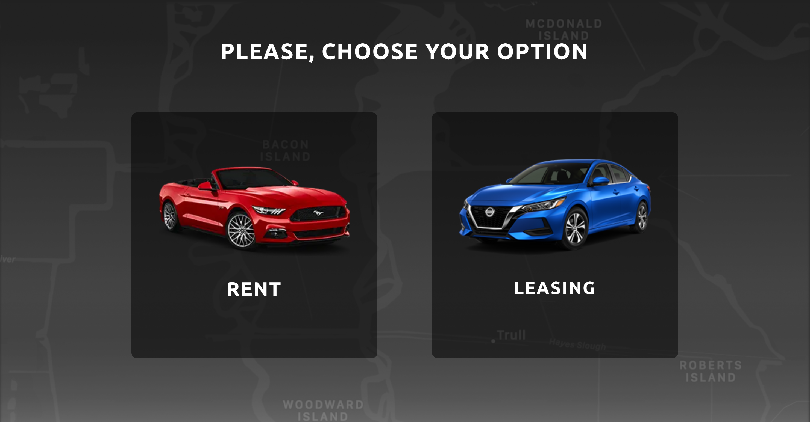
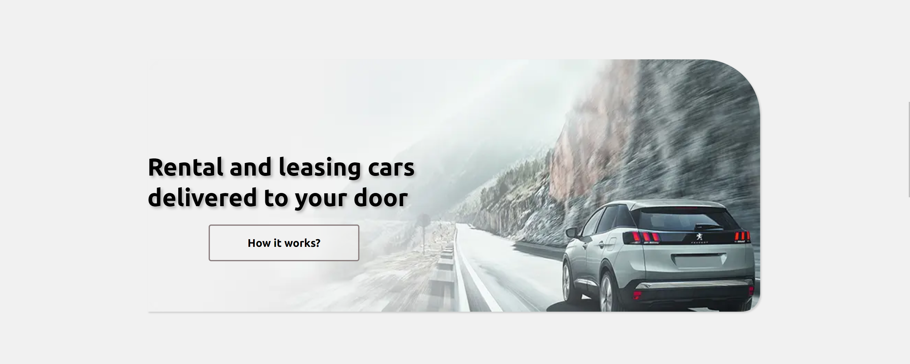
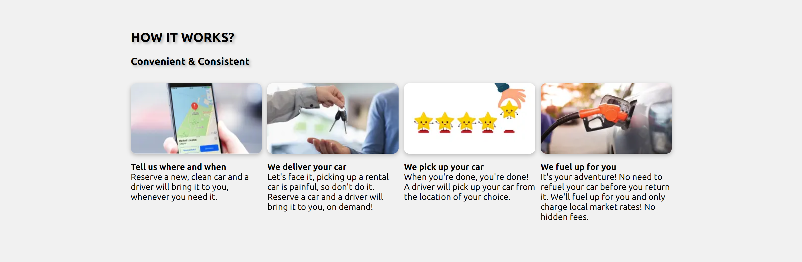
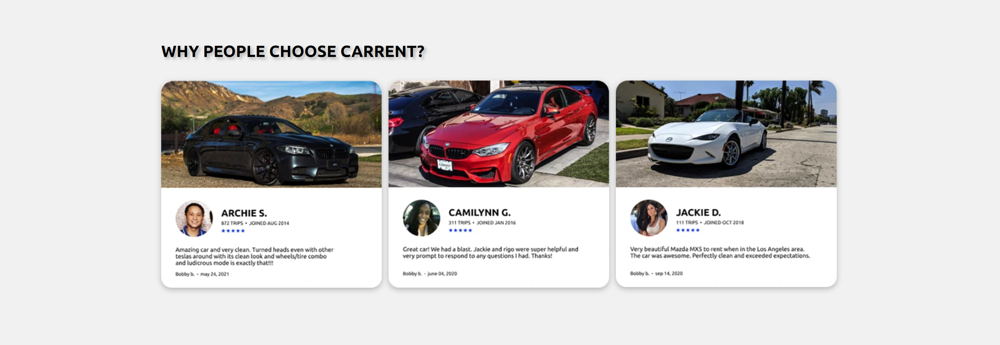
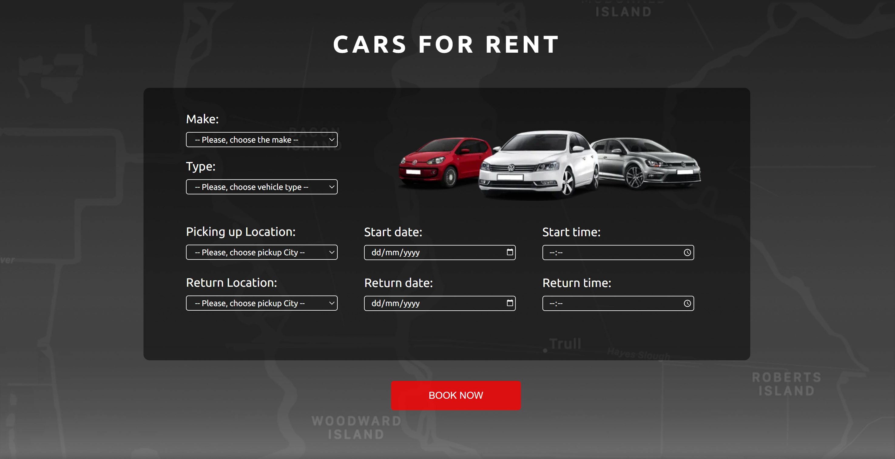
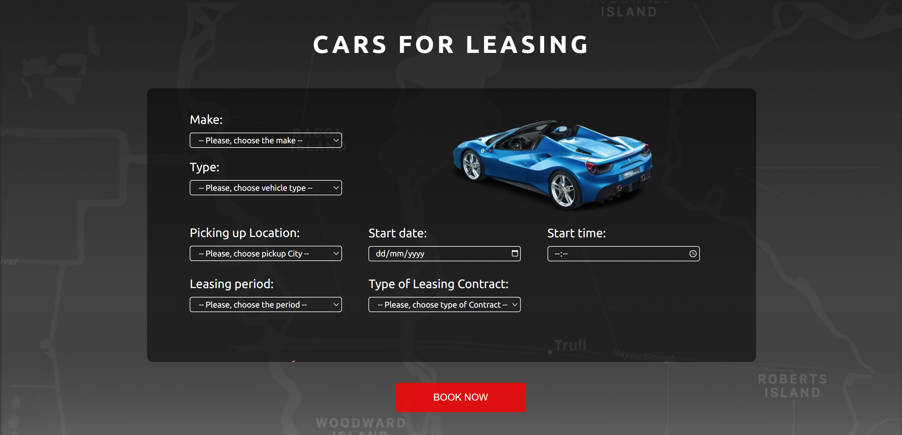
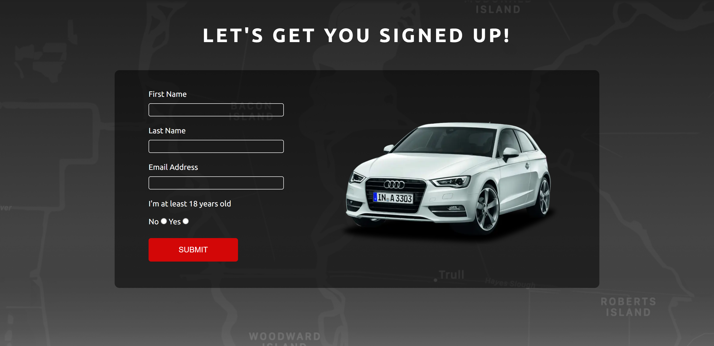
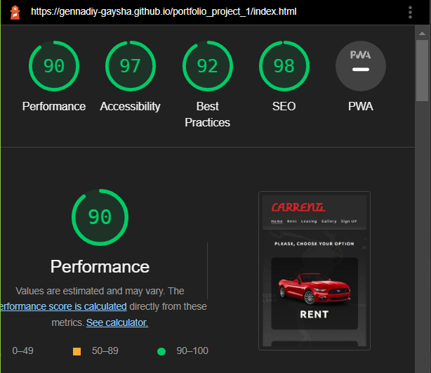

# CARRENT Car Rental and Leasing

CARRENT is a car rental and leasing website designed to provide individuals and companies with useful services when renting or leasing a car in several cities across the United States, including Los Angeles, San Francisco, Washington, and Boston.

The site targets those who want to eliminate the time-consuming process of renting or leasing a car, such as picking up and returning the car to a desired location or filling up the gas tank before returning the vehicle.

You can visit the deployed website [here](https://gennadiy-gaysha.github.io/portfolio_project_1/index.html)

## Table of Contents
1. [User Experience (UX)](#user-experience-ux)
    1. [Project Goals](#project-goals)
    2. [User Stories](#user-stories)
    3. [Design](#design)
    4. [Typography](#typography)
2. [Features](#features)
    1. [Navigation Bar](#navigation-bar)
    2. [Footer](#footer)
    3. [Home Page](#home-page)
    4. [Cars For Rent Page](#cars-for-rent-page)
    5. [Cars For Lease Page](#cars-for-lease-page)
    6. [Gallery Page](#gallery-page)
    7. [Sign Up Page](#sign-up-page)
3. [Testing](#testing)
    1. [Testing User Stories](#testing-user-stories)
    2. [Testing Style And Functionality](#testing-style-and-functionality)
    3. [Validator Testing](#validator-testing)
    4. [Accessibility](#accessibility)
4. [Finished Product](#finished-product)
5. [Deployment](#deployment)
6. [Credits](#credits)
    1. [Content](#content)
    2. [Media](#media)
    3. [Code](#code)

## User Experience (UX)                   

### Project Goals

- The website design should evoke a desire for car trips and travel among users.

- Present the services offered and information about them to attract more customers.

- Should visually showcase the fleet of cars available for rental or leasing to users.

- Offer opportunities to the customers to book services once they decided to visit the business.

### User Stories

- As a customer, I want to be able to navigate the website intuitively and learn more about the services being offered.

- As a customer, I want to easily book the offered services.

- As a customer, I want to find out the working hours and how to contact the business and its representatives.

- As a customer, I want to find links to the business's social media accounts.

- As a customer, I want to easily find the business's location.

### Design 

 - For this project, the [initial design](https://www.figma.com/file/RFOv8bgmCO04pBrn5i2DnS/Untitled?node-id=0%3A1&t=HnHRoD0N402QrTta-1) was [simplified](https://www.figma.com/file/3OIcTkyHELySi8vHELrORu/Project_1?node-id=0%3A1&t=lD2Em3jeoVDLDZ9l-1) using the Figma web application. Later on, during the course of the work, some small amendments were made to the adapted design to ensure that it corresponded to the code that was applied.

  

### Typography

 - The main font used in the site is Ubuntu, with Sans Serif as the fallback font in case Ubuntu is not being imported correctly. This font was used for all headings, paragraphs, forms, and button values. The Warnes font has been chosen for the site logo with Sans Serif used again as a fallback.

[Back To The Table of Contents](#table-of-contents)

## Features

### Navigation Bar

- Featured on all four pages, the full responsive navigation bar includes links to the Logo, Rent and Leasing pages, Why CARRENT? section of the Home Page and Sign Up page and is identical in each page.
- This section will allow the user to easily navigate from page to page across all devices without having to revert back to the previous page via the ‘back’ button.

    

### Footer 

- The footer section includes links to the relevant social media sites for CARRENT. The links will open to a new tab to allow easy navigation for the user. It encourages them to keep connected via social media.
- The footer also contains information about CARRENT address and openning hours.
    
    

### Home Page

- the Main Image section
    - Contains Call to Action Section. 
    - Consists of two car images that are links to "Rent a Car" and "Lease a Car" site pages. These allows the user to choose between two optins, whether to rent or lease the car.

    

- The firm ethos section
    - Contains the CARRENT hero image and slogan, which describes shortly the main goal of the firm.
    - Allows the user to see all the benefits of CARRENT service by clicking on "How it works button" which refers to appropriate section of the HOME PAGE.

    

- Location section
    - Contains gallery of cities' images wehre CARRENT officies are presented.
    - This section is valuable to the users as they will be able to easily identify where they can use CARRENT service.

    

- How it works section
    - Allows the user to see the benefits of using CARRENT services as compared to other competitors. 
    - The user will see the value of signing up to CARRENT site.

    

- Why CARRENT? section
    - Shows clearly why people choose CARRENT Car Rental and Leasing company.
    - Contains a number of customers reviews where the describe their experience whit CARRENT

    

[Back To The Table of Contents](#table-of-contents)

### Cars For Rent Page

- Comprise a form for customers which intend to rent a car.
- There are several mandatory and intuitively obvious fields that user have to fill in to book a car.

### Cars For Lease Page

- Comprise a form for customers which intend to lease a car.
- There are several mandatory and intuitively obvious fields that user have to fill in to get lease proposal.

### Gallery Page

- This website page visually shows the user examples of cars that can be rented or leased.

### Sign Up Page

- This page will allow the user to get signed up to CARRENT to become a customer. 
- The user will be asked to submit their full name and email address.
- Also there is a possibility to quick register via visitor Facebook or Google account.

[Back To The Table of Contents](#table-of-contents)

## Testing

### Testing User Stories

- As a customer, I want to be able to navigate the website intuitively and learn more about the services being offered.
    - The website provides an easy-to-use layout that allows customers to quickly and easily find the information they need.
    - The navigation bar is prominently displayed on all pages, making it simple for customers to locate and use.

- As a customer, I want to easily book the offered services.
    - The 'Rent' and 'Leasing' links on the 'Call to Action' section of the Main Page and links to the 'Rent' and 'Leasing' pages on the navigation bar provide easy access to the form where the user can book a service.

- As a customer, I want to find out the working hours and how to contact the business and its representatives.
    - The user can easily find information about the business's working hours and contacts in the footer, which is located at the end of each page.

- As a customer, I want to find links to the business's social media accounts.
    - The Footer of each webpage contains hyperlinks that direct users to the various social media platforms where the business has a presence.

- As a customer, I want to easily find the business's location.
    - On the Main Page, there is an interactive Google Map adjacent to the footer where the user can find the business's location.

### Testing Style And Functionality

| **Feature**                    | **Element**                  | **Test**      | **Outcome**                                                                                                              | **Pass/Fail** |
|--------------------------------|------------------------------|---------------|--------------------------------------------------------------------------------------------------------------------------|---------------|
| Navigation bar                 | Main logo link               | Functionality | Clicking the link on any page redirects to the home page                                                                 | Pass          |
|                                | Menu items                   | Functionality | Clicking any menu link redirects to the appropriate page                                                                 | Pass          |
|                                |                              | Style         | Menu item of current page is underlined                                                                                  | Pass          |
|                                |                              | Style         | Hover effect makes menu item underlined on any page                                                                      | Pass          |
|                                | Navigation bar appearance    | Style         | Looks the same on any page                                                                                               | Pass          |
| Footer                         | Social media links           | Functionality | Clicking FB, Twitter, Youtube and Instagram links redirects to appropriate site and open in a new window                 | Pass          |
|                                | Footer appearance            | Style         | Looks the same on any page                                                                                               | Pass          |
| Main page                      | Call to action (cat) section | Functionality | Clicking RENT or LEASING link redirects to RENT or LEASING page respectively                                             | Pass          |
|                                | Main image section           | Functionality | Clicking HOW IT WORKS button redirects to HOW IT WORKS SECTION of the main page                                          | Pass          |
|                                | Embedded map section         | Functionality | Embedded Google map is interactive                                                                                       | Pass          |
| Rent, Leasing and Signup pages | Form field                   | Functionality | All form fields work correctly, in accordance with their type                                                            | Pass          |
|                                | Form field                   | Functionality | Each field requires entry before submitting the form                                                                     | Pass          |
|                                | Form field                   | Style         | Hover effect changes border color of any field from white to green                                                       | Pass          |
|                                | Submit button                | Functionality | Clicking submit button sends all the information provided by the user to dedicated server                                | Pass          |
|                                | Submit button                | Style         | Hover effect makes submit button more vivid                                                                              | Pass          |
| Gallery section                | Photos                       | Style         | The dimensions of the photos where chosen in such a way (no special css-style) that their set formed a regular rectangle | Pass          |
| Site                           | All pages                    | Functionality | All site functions work correctly and the same in browsers that have different engines, i.e. Chrome, Firefox and Safari  | Pass          |
|                                |                              | Style         | The site appearance is the same in browsers that have different engines, i.e. Chrome, Firefox and Safari                 | Pass          |
| Site responsiveness            | All pages                    | > 1200px      | Look good and function on the chosen screen size using the Chrome devtools toolbar                                       | Pass          |
|                                |                              | <= 1200px     | Look good and function on the chosen screen size using the Chrome devtools toolbar                                       | Pass          |
|                                |                              | <= 992px      | Look good and function on the chosen screen size using the Chrome devtools toolbar                                       | Pass          |
|                                |                              | <= 768px      | Look good and function on the chosen screen size using the Chrome devtools toolbar                                       | Pass          |
|                                |                              | <= 480px      | Look good and function on the chosen screen size using the Chrome devtools toolbar                                       | Pass          |

### Validator Testing

- HTML 
    - Main page - no errors were returned when passing through the official [W3C validator - index.html](https://validator.w3.org/nu/?doc=https%3A%2F%2Fgennadiy-gaysha.github.io%2Fportfolio_project_1%2Findex.html)
    - Rent page - no errors were returned when passing through the official [W3C validator - rent.html](https://validator.w3.org/nu/?doc=https%3A%2F%2Fgennadiy-gaysha.github.io%2Fportfolio_project_1%2Frent.html)
    - Leasing page - no errors were returned when passing through the official [W3C validator - leasing.html](https://validator.w3.org/nu/?doc=https%3A%2F%2Fgennadiy-gaysha.github.io%2Fportfolio_project_1%2Fleasing.html)
    - Gallery page - no errors were returned when passing through the official [W3C validator - gallery.html](https://validator.w3.org/nu/?doc=https%3A%2F%2Fgennadiy-gaysha.github.io%2Fportfolio_project_1%2Fgallery.html)
    - Signup page - no errors were returned when passing through the official [W3C validator - signup.html](https://validator.w3.org/nu/?doc=https%3A%2F%2Fgennadiy-gaysha.github.io%2Fportfolio_project_1%2Fsignup.html)
- CSS 
    - style.css - no errors were found when passing through the official [(Jigsaw) validator](https://jigsaw.w3.org/css-validator/validator?uri=https%3A%2F%2Fgennadiy-gaysha.github.io%2Fportfolio_project_1%2F&profile=css3svg&usermedium=all&warning=1&vextwarning=&lang=en)

### Accessibility

- I confirmed that the colors and fonts chosen are easy to read and accessible by running it through Lighthouse in Devtools

[Back To The Table of Contents](#table-of-contents)

## Finished Product

## Deployment

- This website was developed using [GitPod](https://www.gitpod.io/), which was then committed and pushed to GitHub using the GitPod terminal.

- The site was deployed to GitHub pages. The steps to deploy are as follows: 
    1. Log in to GitHub and locate the [GitHub Repository](https://github.com/).
    2. At the top of the Repository, locate the Settings button on the menu.
    3. On the left of the Settings page choose the Pages section.
    4. Under Source, click the dropdown called None and select Main Branch.
    5. The page will refresh automatically and generate a link to your website.

You can visit the deployed website  [here](https://gennadiy-gaysha.github.io/portfolio_project_1/index.html)

## Credits

- I'm acknowleged to [Vlad Buharkin](https://www.facebook.com/vlad.buharkin) for the idea of [Web design](https://www.figma.com/file/RFOv8bgmCO04pBrn5i2DnS/Untitled?node-id=0%3A1&t=HnHRoD0N402QrTta-1) for this site.

### Content

- Instructions on how to implement form validation on the Sign Up page was taken from [Specific YouTube Tutorial](https://www.youtube.com/).
- The icons in the footer were taken from [Font Awesome](https://fontawesome.com/) site.
- Markdown for the testing table in readme.md file was created using [Tables Generator](https://www.tablesgenerator.com/markdown_tables) 

### Media

- All photos used on the Home, Rent, Leasing and Sign up pages were taken from the [mockup](https://www.figma.com/file/RFOv8bgmCO04pBrn5i2DnS/Untitled?node-id=0%3A1&t=HnHRoD0N402QrTta-1) provided by [Vlad Buharkin](https://www.facebook.com/vlad.buharkin).
- The images used for the [gallery page](https://gennadiy-gaysha.github.io/portfolio_project_1/gallery.html) were taken from [this](https://www.pexels.com/) open source site.

### Code

- I've been constantly using [Stack Overflow](https://stackoverflow.com/), 
[W3Schools](https://www.w3schools.com/) and Chrome Dev tools for inspiration 
and better understanding the code being implemented.
- To implement the social media icon grow effect (while hovering on it) I use a code snippet from the opensourse site [Hover.css](https://ianlunn.github.io/Hover/)

[Back To The Table of Contents](#table-of-contents)